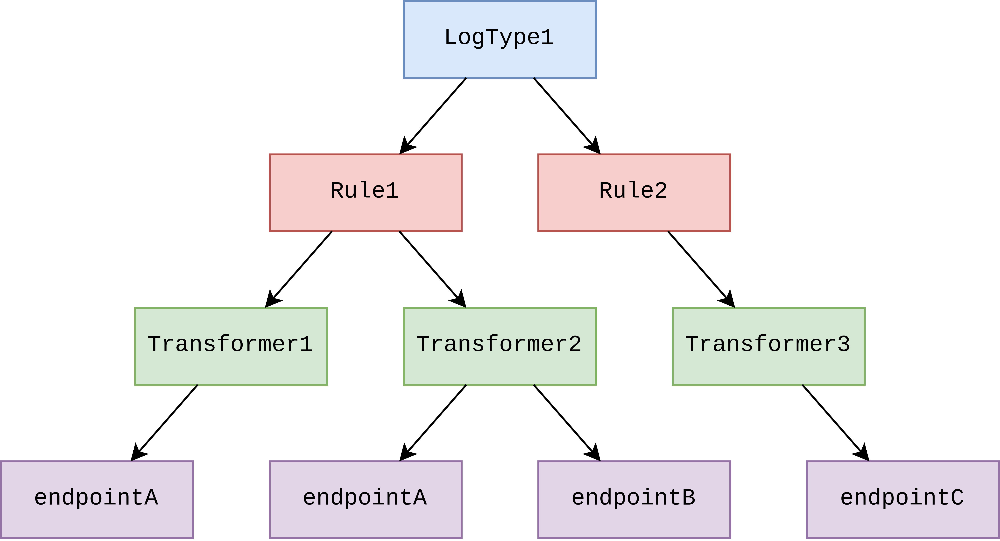

# Overview

- [What is sendlog?](#what-is-sendlog)
- [Understanding Plugins](#understanding-plugins)
- [Configuration](#configuration)

## What is sendlog?

sendlog is a lightweight, extensible framework for log monitoring and alerting. It allows you to set up automatic alerts for any log files by writing custom plugins for each application, event, and endpoint.

## Understanding Plugins

In sendlog, **workflows** are a linear set of processes that transform a log into a payload and send it to an endpoint.

**Worktrees** are a set of processes organised in a tree, where a single path represents a workflow. This is more efficient than lots of separate workflows, because operations do not need to be repeated.

These processes are defined in plugins, using a Python-based Domain-Specific Language. See [Plugin DSL]() for more information on writing plugins.

## Configuration

The configuration file specified runtime information required by the program, such as which plugins to load.

For more information on configuring sendlog, see the [Configuration File](config.md) documentation.
